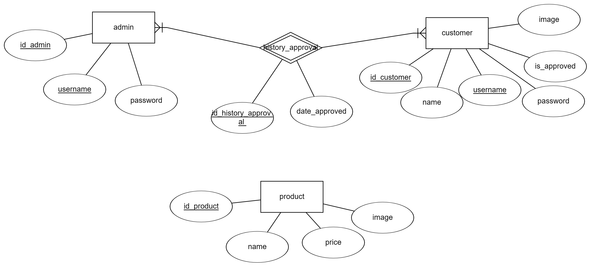
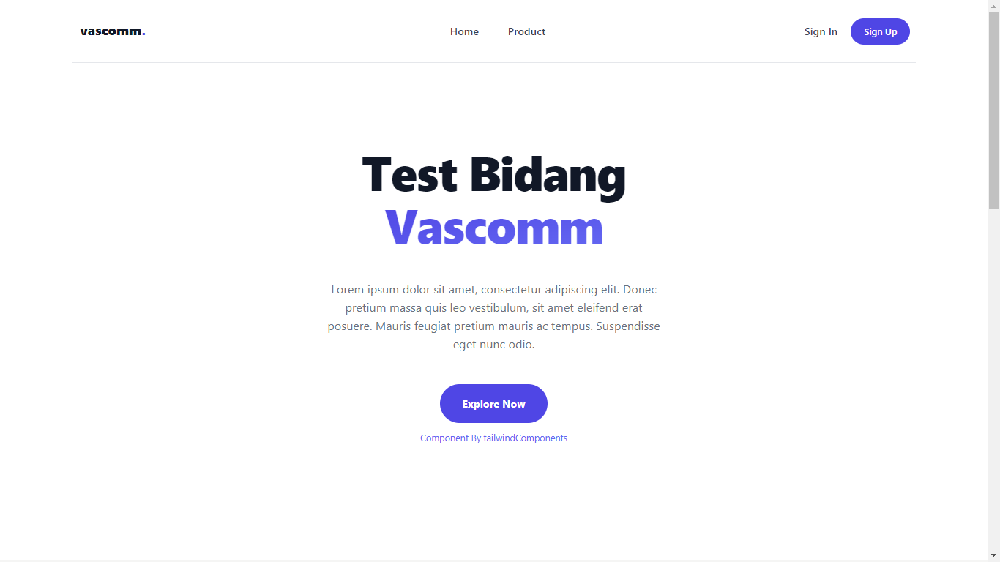
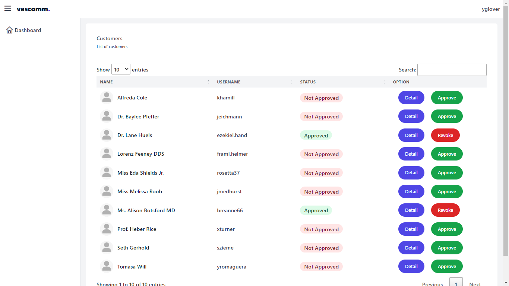

# Test Bidang Viscomm

## Screenshoot

## Installation 

-   Execute hthttps://github.com/Richie-Z/test-bidang-vascomm.git on your terminal to download this project.
-   Go to the project root directory and execute composer install
-   Create a file named as .env and copy the content of .env.example to newly created .env file
-   Then execute php artisan key:generate on your terminal/cmd to generate environment key
